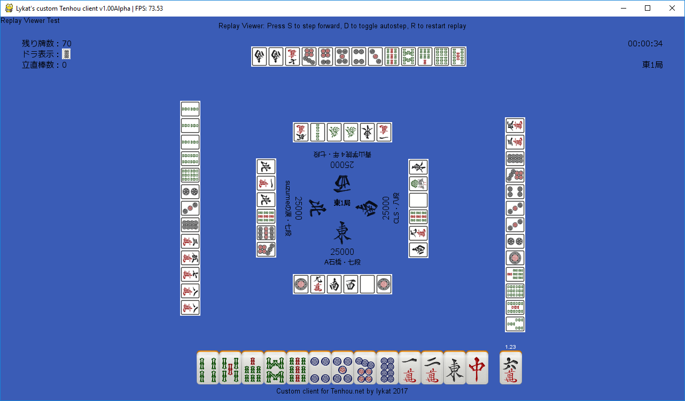

# Custom Tenhou.net Client

This is a custom client for playing Japanese mahjong on the Tenhou.net servers. It is written in Python 3 and uses the
PyGame library.

## Credits

Many thanks to the author of the excellent Tenhou Protocol Documentation over
at http://arcturus.su/~alvin/docs/tenhoudoc which has been a great reference
manual during the development of this client.

